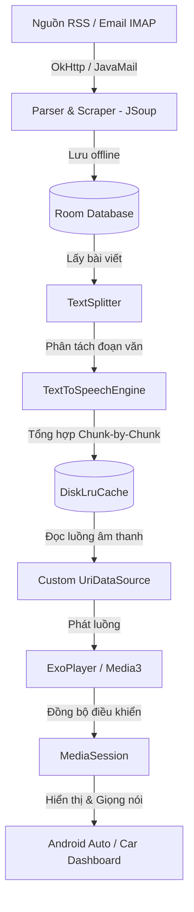

# ReadingApp - Trình Đọc Báo RSS & Email Bằng Giọng Nói Cho Android

**ReadingApp** là một ứng dụng di động Android hiện đại được viết bằng Kotlin, cho phép người dùng nghe báo mạng (RSS) và hòm thư cá nhân (Email IMAP) thông qua công nghệ tổng hợp giọng nói (Text-To-Speech - TTS). Được thiết kế tối ưu với bộ đệm bộ nhớ thông minh và tích hợp sâu với **Jetpack Media3 (ExoPlayer, MediaSession)**, ứng dụng hỗ trợ đầy đủ **Android Auto**, cho phép người dùng lái xe an toàn trong khi vẫn có thể cập nhật thông tin và kiểm tra thư từ cá nhân.

---

## 🧭 Kiến Trúc Hệ Thống & Luồng Hoạt Động (Dataflow)

Ứng dụng được thiết kế theo mô hình **MVVM (Model-View-ViewModel)** chuẩn, chia làm các tầng xử lý dữ liệu và phát âm thanh khép kín:



### 🧠 Cơ Chế Tổng Hợp TTS & Xử Lý Phát Nhạc Động (Dynamic Chunk Synthesis)

Để khắc phục độ trễ (latency) khi tổng hợp các bài viết dài bằng TTS trên thiết bị di động, `AudioPlayer` sử dụng cơ chế chia nhỏ văn bản và truyền phát tối ưu:
1. **Chia nhỏ văn bản (Text Splitting)**: Toàn bộ bài báo hoặc nội dung email sẽ được đưa qua `TextSplitter` để chia thành nhiều chunk (đoạn nhỏ) dựa theo dấu câu và ngôn ngữ phù hợp.
2. **Song song hóa đệm (Parallel Buffering)**:
   - Chunk 0 được ưu tiên tổng hợp trước để ngay lập tức trả về file âm thanh và kích hoạt `ExoPlayer` phát nhạc không độ trễ.
   - Trong lúc chunk 0 đang phát, hệ thống chạy ngầm song song việc tổng hợp chunk 1 và chunk 2 để nạp trước vào bộ nhớ cache.
   - Các chunk tiếp theo sẽ được tổng hợp một cách tuần tự nhằm giải phóng CPU và tài nguyên mạng.
3. **Tua thông minh (Lazy Prioritization on Seek)**:
   - Khi người dùng thực hiện tua (seek) đến một mốc thời gian bất kỳ, hệ thống sẽ tính toán xem mốc thời gian đó nằm ở chunk thứ mấy.
   - Ngay lập tức, luồng chạy ngầm cũ sẽ bị hủy (cancel) để nhường quyền ưu tiên tổng hợp cho chunk đích đó trước. Sau khi chunk đích sẵn sàng, trình phát sẽ phục hồi chơi nhạc ngay tại mốc đó, rồi mới tiếp tục tải ngầm các chunk còn lại xung quanh.

```mermaid
gantt
    title Minh họa Song song hóa đệm (Parallel Buffering)
    dateFormat  X
    axisFormat %s
    section Phát Nhạc (ExoPlayer)
    Phát Chunk 0           :active, p0, 0, 10
    Phát Chunk 1           : p1, 10, 20
    section Xử lý TTS (Background)
    Tổng hợp Chunk 0 (Ưu tiên) :done, t0, 0, 2
    Tổng hợp Chunk 1           :done, t1, 2, 5
    Tổng hợp Chunk 2           :done, t2, 5, 8
    Tổng hợp Chunk 3           :t3, 8, 11
```



4. **Bộ đệm đĩa vòng (DiskLruCache)**: Tất cả các file giọng nói đã tổng hợp xong sẽ được lưu trữ cục bộ để phục vụ phát offline và tiết kiệm tối đa pin cũng như hiệu năng thiết bị.


---

## 🌟 Các Tính Năng Nổi Bật

- **Trình Phát Giọng Nói Thông Minh**:
  - Hỗ trợ phát nhạc chạy nền thông qua `MediaLibraryService` của Media3.
  - Quản lý tiêu điểm âm thanh (`AudioFocusManager`) thông minh: Tự động dừng khi có cuộc gọi đến, nhỏ tiếng (ducking) khi có chỉ đường GPS.
- **Đọc Báo RSS & Trích Xuất Toàn Văn**:
  - Nạp các danh mục tin tức từ VnExpress, Tuổi Trẻ, Thanh Niên, Dân Trí và The Guardian.
  - Sử dụng thư viện `JSoup` để tự động bóc tách bài viết sạch (loại bỏ quảng cáo, menu điều hướng).
  - Tự động phát hiện ngôn ngữ của bài viết (Tiếng Việt/Tiếng Anh) để điều chỉnh giọng đọc tương ứng.
- **Đọc Hòm Thư Email Cá Nhân (IMAP)**:
  - Kết nối bảo mật và đồng bộ các hộp thư chính (Inbox, Sent, Drafts) hoặc các thư mục tùy chỉnh.
  - Tự động chuẩn hóa nội dung email (lọc mã HTML, liệt kê tệp đính kèm) trước khi đưa vào TTS.
- **Giao Diện Android Auto Cao Cấp**:
  - Hiển thị danh sách tin tức theo nguồn tin và danh mục trực quan trên màn hình xe hơi.
  - Điều khiển chuyển bài, tạm dừng và tua nhanh thuận tiện ngay trên tay lái hoặc bảng điều khiển xe.
- **Cấu Hình Giọng Đọc Linh Hoạt**:
  - Cho phép người dùng tùy chỉnh tốc độ đọc (speech rate) và tông giọng (pitch) phù hợp nhất với tai nghe mỗi người.


---


## 🛠️ Công Nghệ & Thư Viện Sử Dụng

- **Jetpack Media3 (ExoPlayer + MediaSession + Common)**: Trực quan hóa và điều khiển phát đa phương tiện.
- **Room Database (với KSP compiler)**: Cơ sở dữ liệu SQLite offline để lưu trữ bài báo và email.
- **WorkManager**: Lên lịch tự động cập nhật tin tức và email chạy ngầm định kỳ.
- **OkHttp & JSoup**: Tải trang web và bóc tách cấu trúc HTML của các báo điện tử.
- **JavaMail API (android-mail)**: Giao thức IMAP đồng bộ thư từ.
- **DiskLruCache**: Quản lý lưu trữ bộ đệm file âm thanh cục bộ.
- **Glide**: Tải và hiển thị ảnh thumbnail cho danh sách bài viết.

---

## 📁 Cấu Trúc Thư Mục Dự Án

```text
com.example.readingapp/
│
├── core/
│   ├── audio/              # Quản lý ExoPlayer, DiskLruCache và AudioFocus
│   ├── datastore/          # Lưu trữ cấu hình ứng dụng (Settings) và trạng thái cục bộ
│   ├── tts/                # Bộ công cụ chia nhỏ văn bản và động cơ TTS gốc của Android
│   └── model/              # Các đối tượng dữ liệu dùng chung (ReadableContent, PlayerState)
│
├── feature/
│   ├── home/               # Màn hình chính phân chia lối vào Đọc báo / Đọc Email
│   ├── news/               # Các tác vụ tải RSS, cào bài báo JSoup, SQLite Room và giao diện Tin tức
│   ├── email/              # Đăng nhập IMAP qua JavaMail, lưu Room, giao diện hòm thư
│   └── settings/           # Giao diện và cấu hình giọng đọc TTS (Tốc độ, tông giọng)
│
└── media/
    ├── ReadingMediaService # MediaLibraryService chạy nền giữ kết nối với Android Auto
    ├── androidauto/        # Bộ sinh cây thư mục Media Browser cho màn hình xe hơi
    └── playback/           # Bộ điều phối hàng chờ (PlaylistProvider) và MediaSession handler
```

---

## 🚀 Hướng Dẫn Cài Đặt & Cấu Hình

### 1. Chuẩn bị
* **Java Development Kit (JDK)**: Phiên bản 17.
* **Android SDK**: Compile SDK `35`, Min SDK `24`.
* **Android Studio**: Bản Ladybug hoặc mới hơn.

### 2. Cài đặt Dự án
Tải mã nguồn về máy tính cá nhân:
```bash
git clone https://github.com/Dieenj/readingapp.git
cd readingapp
```
Mở thư mục trên bằng Android Studio, đợi đồng bộ Gradle tải hết các thư viện cần thiết.

### 3. Cấu Hình Email IMAP (Quan Trọng)
Để tính năng đọc Email hoạt động, tài khoản email của bạn cần được cấp quyền truy cập IMAP:
- **Đối với Gmail**:
  1. Truy cập vào tài khoản Google cá nhân của bạn.
  2. Bật xác thực 2 bước (2-Step Verification).
  3. Tìm kiếm từ khóa **Mật khẩu ứng dụng (App Passwords)** và tạo một mật khẩu mới cho ứng dụng.
  4. Sử dụng địa chỉ email Gmail và chuỗi mật khẩu ứng dụng 16 ký tự vừa tạo để đăng nhập vào ứng dụng ReadingApp.
- **Đối với Outlook / Yahoo**: Hãy đảm bảo bạn đã bật tính năng cho phép kết nối IMAP trong cài đặt hòm thư trực tuyến.

### 4. Cấu Hình Danh Sách Nguồn Báo RSS
Dự án được cấu hình sẵn các nguồn báo lớn tại [NewsSourceConfig.kt](app/src/main/java/com/example/readingapp/feature/news/data/remote/NewsSourceConfig.kt).
Nếu bạn muốn bổ sung trang báo hoặc danh mục mới, chỉ cần thêm dòng khai báo địa chỉ RSS vào biến `NEWS_SOURCES` bên trong file này.

### 5. Quản Lý Bảo Mật & Biến Môi Trường
Để tránh rò rỉ thông tin đăng nhập email hoặc các khóa cấu hình bảo mật lên các kho mã nguồn mở như GitHub:
- **Tuyệt đối không hardcode** thông tin tài khoản IMAP/SMTP hoặc các khóa API trực tiếp vào mã nguồn Java/Kotlin.
- Hãy sử dụng tệp `local.properties` (nằm trong danh sách đã bỏ qua của `.gitignore`) ở thư mục gốc của dự án để cấu hình các biến bảo mật cục bộ.
- Bạn có thể khai báo chúng dưới dạng các biến môi trường rồi tải động thông qua file `build.gradle.kts` như sau:
  ```kotlin
  // Ví dụ tải cấu hình bảo mật từ local.properties
  val properties = java.util.Properties()
  val propertiesFile = rootProject.file("local.properties")
  if (propertiesFile.exists()) {
      properties.load(propertiesFile.inputStream())
  }
  val emailPlaceholder = properties.getProperty("EMAIL_USER") ?: ""
  ```

---

## 🚗 Hướng Dẫn Kiểm Thử Trên Android Auto

Để kiểm thử giao diện xe hơi trên máy tính:
1. Tải ứng dụng **Android Auto** trên điện thoại cá nhân.
2. Bật chế độ nhà phát triển (Developer Mode) trên ứng dụng Android Auto bằng cách gõ liên tục 10 lần vào phần phiên bản (Version) trong Cài đặt.
3. Kích hoạt tính năng **Khởi động máy chủ bộ phận đầu (Start Head Unit Server)** từ menu góc phải.
4. Cài đặt **Desktop Head Unit (DHU)** từ Android Studio SDK Manager (nằm trong mục `SDK Tools` -> `Android Auto Desktop Head Unit emulator`).
5. Kết nối điện thoại với máy tính qua cáp USB và chạy lệnh chuyển tiếp cổng:
   ```bash
   adb forward tcp:5277 tcp:5277
   ```
6. Khởi động DHU từ thư mục SDK của bạn để kiểm thử giao diện ReadingApp trên màn hình giả lập ô tô.

---

## ❓ Khắc Phục Sự Cố Thường Gặp (Troubleshooting)

### 1. Không kết nối được với Desktop Head Unit (DHU)
- **Triệu chứng**: Giao diện DHU hiện màn hình đen hoặc báo lỗi kết nối.
- **Cách khắc phục**:
  - Đảm bảo tính năng **USB Debugging** (Gỡ lỗi USB) trên điện thoại Android của bạn đã được kích hoạt.
  - Kiểm tra xem cổng adb đã chuyển tiếp đúng chưa bằng lệnh `adb devices`. Nếu chưa nhận thiết bị, hãy cắm lại cáp hoặc thay cổng kết nối USB.
  - Chạy lại lệnh chuyển tiếp cổng: `adb forward tcp:5277 tcp:5277`. Lệnh này đôi lúc cần được chạy lại nếu bạn rút cáp điện thoại ra cắm lại.
  - Đảm bảo máy chủ Android Auto Head Unit Server đang chạy ngầm trên điện thoại (kiểm tra thanh thông báo).

### 2. Lỗi đăng nhập Email (IMAP Authentication Failed)
- **Triệu chứng**: Gặp lỗi xác thực tài khoản khi đồng bộ thư mục hoặc tìm nạp thư mới.
- **Cách khắc phục**:
  - Đảm bảo bạn đang sử dụng **Mật khẩu ứng dụng (App Password)** chứ không phải mật khẩu đăng nhập tài khoản Google thông thường.
  - Đảm bảo giao thức **IMAP** đã được bật trong cài đặt hộp thư của bạn (truy cập giao diện Webmail của Gmail/Outlook để kiểm tra cài đặt chuyển tiếp POP/IMAP).
  - Đối với một số nhà mạng hoặc cấu hình mạng đặc biệt, cổng IMAP (993) hoặc SMTP (465/587) có thể bị chặn. Kiểm tra kết nối mạng Wi-Fi hoặc chuyển sang mạng 4G/5G để thử lại.

### 3. Không có âm thanh khi phát hoặc lỗi TTS
- **Triệu chứng**: ExoPlayer hiển thị trạng thái phát bình thường nhưng không có tiếng đọc phát ra.
- **Cách khắc phục**:
  - Đảm bảo thiết bị đã tải gói ngôn ngữ phù hợp (ví dụ: Tiếng Việt) trong ứng dụng cài đặt hệ thống của Android (`Settings -> System -> Languages & input -> Text-to-speech output`).
  - Kiểm tra dung lượng bộ nhớ trống trên thiết bị, cơ chế bộ đệm `DiskLruCache` yêu cầu dung lượng đĩa khả dụng để tải và lưu tạm các phân đoạn âm thanh.

---

## 📄 Giấy Phép (License)

Dự án này được phân phối dưới giấy phép **Apache License 2.0**. Xem tệp `LICENSE` để biết thêm chi tiết.
